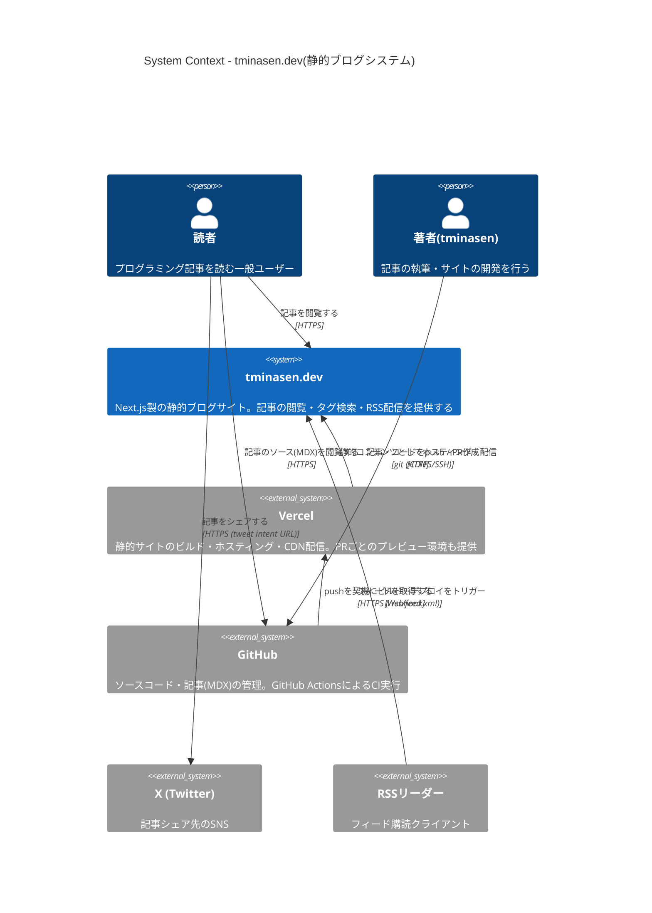
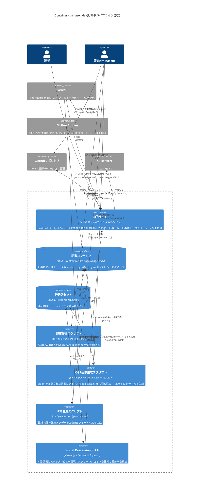

# システム構成図(C4モデル)

tminasen.dev(水無瀬のプログラミング日記)のシステム構成を、C4モデルの Level 1(System Context)および Level 2(Container)で記述する。

## アーキテクチャの要点

- Next.js 16(Pages Router + MDX)で `output: 'export'` の完全静的サイト(SSG)。ランタイムのバックエンドは持たない
- 記事は `src/pages/blog/*.mdx` としてリポジトリ内に格納され、GitHubが記事コンテンツのマスターデータ置き場を兼ねる
- ホスティングはVercel(本番: tminasen.dev + PRごとのプレビューデプロイ)
- OGP画像・RSSフィードはローカルのCLIスクリプトで事前生成し、生成物ごとコミットする方式(ビルド時には再生成しない)
- CIはGitHub ActionsによるVisual Regression Test(本番とVercelプレビューのスクリーンショット比較)

## Level 1: System Context(システムコンテキスト図)

### 補足(コンテキストレベルの関係性)

- 本システムはランタイムのバックエンドを一切持たない完全静的サイトである。動的な処理(シェア、ソース閲覧)はすべて外部システムへのリンクで実現している
- 記事公開のトリガーは `git push`(GitHubへのマージ)である

## Level 2: Container(コンテナ図)

### 補足(コンテナレベルのデータフロー)

1. **執筆フロー**: 著者がCLIスクリプトで記事雛形を作成 → MDXを執筆 → OGP画像・RSSをローカルで生成してcommit(生成物もリポジトリにコミットする方式で、ビルド時には再生成しない)
2. **ビルド・配信フロー**: `next build` 時に `gray-matter` でfrontmatterをパースし、`remark-gfm` / `rehype-pretty-code`(shiki)でMDXを変換して静的HTMLを出力。Vercelがそのままエッジ配信するため、実行時のサーバーコンポーネントやAPIは存在しない
3. **品質保証フロー**: PR作成時にGitHub ActionsがGitHub Deployment APIをポーリングしてVercelプレビューURLを取得し、Playwrightで本番と全ページのスクリーンショット差分(pixelmatch)を検証する

## 備考

- ルートの `Cargo.toml` はワークスペースメンバーとして `scripts/article-scripts` を指定しているが、当該ディレクトリに Rust ソースは存在せず TypeScript(`article-creator.mts`)のみである。Rust版スクリプトからの移行の名残と思われるため、本図には含めていない
- README の Netlify バッジは旧構成の名残であり、現在のホスティングは Vercel である
