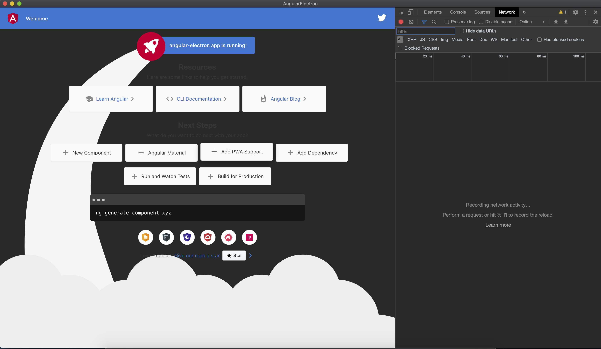

# 概要
Electronが気になっていた今日このごろ。  
Angularを久しぶりに触りたいこともあり、Angular + Electronでアプリを作ってみようと思う。  
とりあえずAngular-CLIで作ったテンプレートをElectron使って起動できるところまですすめていく。

# TL;DR.
[ソースコード](https://github.com/Tetsuya-Minase/program-samples/tree/master/angular-electron)

# 手順
## Angularプロジェクト作成
```bash
# いつも通りCLIからスタート
$ng new angular-electron
```

## Electronインストール
```bash
$ npm install electron --save-dev
```

# 起動できるように修正
[公式ドキュメント](https://www.electronjs.org/docs/tutorial/first-app) と[angular-electron](https://github.com/maximegris/angular-electron) を参考に作っていく。

## Angular.jsonを修正
`projects > architect > build > oprions > outputPath`を`/dist/プロジェクト名(今回はangular-electron)`を`dist`のみに修正。

```json
{
  ...
  "projects": {
    ...
      "architect": {
        "build": {
          ...
          "options": {
            "outputPath": "dist",
            ...
```

## main.jsを作成
アプリを起動するためのjsを作成する。  
tsで書きたかったりホットリロードとかも試したいところだけど、  
一旦jsでちゃんと動くところまで確認する。

```jsx
const { app, BrowserWindow, screen } = require('electron');
const url = require('url');
const path = require('path');

let win = null;

function createWindow() {
  const electronScreen = screen;
  const size = electronScreen.getPrimaryDisplay().workAreaSize;

  // ブラウザウインドウを作成
  win = new BrowserWindow({
    x: 0,
    y: 0,
    width: size.width,
    height: size.height,
    webPreferences: {
      nodeIntegration: true
    }
  })

  win.loadURL(url.format({
    pathname: path.join(__dirname, 'dist/index.html'),
    protocol: 'file:',
    slashes: true
  }));

  // dev toolを開く
  win.webContents.openDevTools();

  win.on('closed', () => win = null);

  return win;
};

app.allowRendererProcessReuse = true;

app.on('ready', () => setTimeout(createWindow, 400));
app.on('window-all-closed', () => {
  if (process.platform !== 'darwin') {
    app.quit();
  }
});
app.on('activate', () => {
  if (win === null) {
    createWindow();
  }
});
```

## package.jsonを修正
`electron`コマンドで起動できるように`package.json`の`main`に上記ファイルを指定する。  

```json
{
	"name": "angular-electron",
	"main": "main.js",
	...
}
```

# 起動できることを確認する
アプリを起動できることを確認する。  
その前にAngularのビルドが必要なので実行しておく。

```bash
# Angularのファイルをビルド(最初から入っているコマンドそのまま)
$ npm run build
> dist配下にファイルが出力されていることを確認

# アプリを起動してみる
$ npx electron .
```

画像のようにAngular-CLIのテンプレートが表示されることを確認できればOK。

;

# まとめ
Electron ＋ Angularでアプリを作ってみようと思ったので、とりあえず起動できるまでやった。  
起動だけならさっくりできたので、次は`main.js`をts化したり、アプリを作っていきたいところ。

# 参考サイト

- [ドキュメント | Electron](https://www.electronjs.org/docs)
- [はじめての Electron アプリ | Electron](https://www.electronjs.org/docs/tutorial/first-app)
- [maximegris/angular-electron: Ultra-fast bootstrapping with Angular and Electron (Typescript + SASS + Hot Reload)](https://github.com/maximegris/angular-electron)
