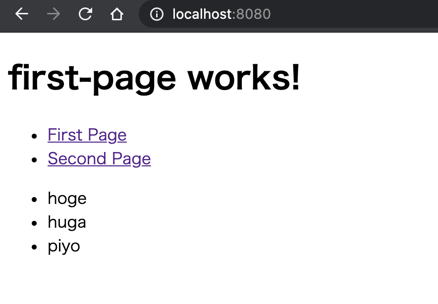
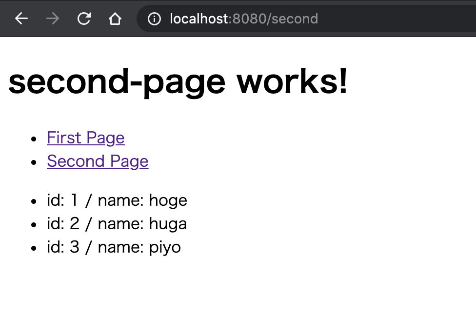

# はじめに
Rustが気になっている今日このごろ。  
最近[Rustの基本的なことをやった]()＋実践Rustプログラミング入門のWebアプリケーションの開発辺りまで読み終えたので、今回はActixWebを触ってみる。  
公式のチュートリアルを進めつつ、Angularで作ったページを表示できるようにしてみる。

# TL;DR.
- [ソースコード](https://github.com/Tetsuya-Minase/program-samples/tree/master/actix-web-sample)

# フロントの準備
後でやるとフォルダ構成がしんどい気がしたので先に作っておく。  
今回使ったFWはAngularなので、cliでサクッと作る。

```bash
$ npx @angular/cli new actix-web-sample
> カスタマイズはお好みで
```

# ActixWeb準備
`cargo new`でプロジェクト作るところからスタート。

```bash
$ cargo new server
$ cd server
# cargo-editを導入しているので、cargo addで追加
# 追加していないならCargo.tomlに手動追加でOK
$ cargo add actix-web actix-rt
```

執筆当時のCargo.tomlのdependenciesはこんな感じ。

```
[dependencies]
actix-rt = "1.1.1"
actix-web = "3.1.0"
```

# 起動して何かしら返せるとこまで実装
公式のチュートリアルを参考にしながら、何かしら返せるとこまで実装する。

```rust
use actix_web::{get, web, App, HttpResponse, HttpServer, Responder};

// こう書くことで、`/`にGetのリクエストが来たときのハンドリングができる
#[get("/")]
async fn greet() -> impl Responder {
    // ステータス200(OK)で、bodyに`Hello world!`を入れて返す
    HttpResponse::Ok().body("Hello world!")
}

// `#[get(...)]`を指定しないと使うときに指定するときもできる
async fn manual_greet() -> impl Responder {
    HttpResponse::Ok().body("Hey! Hey!! Hey!!!")
}

#[actix_web::main]
async fn main() -> std::io::Result<()> {
    HttpServer::new(|| {
        App::new()
        // マクロでroutingを指定した関数はserviceに渡せばOK
        .service(greet)
        // routingを指定していない関数には、ここで指定することができる
        // ↓であれば、`/hey`にgetのリクエストが来たとき
        .route("/hey", web::get().to(manual_greet))
    })
    // ローカルホストのport8080で起動
    .bind("127.0.0.1:8080")?
    .run()
    .await
}
```

アクセスして確認してみる。  
ブラウザで試しても同じだがサクッとcurlで確認。

```bash
$ curl localhost:8080/
> Hello world!

$ curl localhost:8080/hey
> Hey! Hey!! Hey!!!
```

# 静的ファイルを返せるようにする
今回はrustのビルド結果がある`target`ディレクトリ内に`public`ディレクトリを作り、その中にある`index.html`を返すようにする。  
静的ファイルを返すように別のcrateを追加する。

```bash
# actix-filesを追加
# 執筆当時のバージョンは"0.4.0"だった
$ cargo add actix-files
```

## サーバー側の変更
追加が終わったら、先程作ったコードを変更していく。  
変更内容は公式チュートリアルの[この辺](https://actix.rs/docs/url-dispatch/)を参考にする。  
(特に`Changing the default Not Found response`あたり)

```rust
use actix_files;
use actix_web::{web, App, HttpResponse, HttpServer, Responder, Result};

async fn index() -> Result<actix_files::NamedFile> {
    Ok(actix_files::NamedFile::open("target/public/index.html")?)
}

// `#[get(...)]`を指定しないと使うときに指定するときもできる
async fn manual_greet() -> impl Responder {
    HttpResponse::Ok().body("Hey! Hey!! Hey!!!")
}

#[actix_web::main]
async fn main() -> std::io::Result<()> {
    HttpServer::new(|| {
        App::new()
        // ルートにアクセスされたときは`index.html`を返す
        .route("/", web::get().to(index))
        // routingを指定していない関数には、ここで指定することができる
        // ↓であれば、`/hey`にgetのリクエストが来たとき
        .route("/hey", web::get().to(manual_greet))
        // 上記までにマッチしなければ、フォルダに飛ばす
        .service(actix_files::Files::new("", "target/public"))
        // どこにもマッチしなければ`index.html`を返す
        .default_service(
            web::route().to(index)
        )
    })
    .bind("127.0.0.1:8080")?
    .run()
    .await
}
```

## クライアント側の変更
一旦、クライアント側はビルドの設定だけ変更する。  
`angular.json`内の下記箇所を修正。  
※書いていない箇所は生成時のまま。

```json
{
  ...
  "projects": {
    "actix-web-sample": {
      ...
      "architect": {
        "build": {
          "builder": "@angular-devkit/build-angular:browser",
          "options": {
            "outputPath": "server/target/public",
            ...
          }
        }
      }
    }
  }
}
```

変更したら一度ビルド(`npm run build` or `ng build`)して意図した通りの箇所に結果が出てくればOK。  

## 動作確認
クライアントサイドの変更が終わったら、serverディレクトリに移動する。  
`cargo run`で起動後↓のようなURLで問題なく表示できればOK。

**localhost:8080/**


**localhost:8080/hey**


# Angularのルーティングを追加する
ここまででビルドしたクライアントアプリを返せるようにした。  
これで終わっても良いのだが、もうちょっとAngular側を修正する。  
実際にありそうなルーティングとAPIを通してデータを取ってくるというのを実装してみる。  
まずはルーティングの追加をやる。

## ページの追加
まずはクライアント側にページを追加する。  
CLIでコンポーネント増やすところからスタート。

```bash
$ npm run ng g component first-page
$ npm run ng g component second-page
```

## routingを設定
`angular-routing.module.ts`を修正する。  
修正内容はroutingを指定しただけ。

```tsx
import { SecondPageComponent } from './second-page/second-page.component';
import { FirstPageComponent } from './first-page/first-page.component';
import { NgModule } from '@angular/core';
import { Routes, RouterModule } from '@angular/router';

const routes: Routes = [
  {path: '', component: FirstPageComponent},
  {path: 'second', component: SecondPageComponent}
];

@NgModule({
  imports: [RouterModule.forRoot(routes)],
  exports: [RouterModule]
})
export class AppRoutingModule { }
```

## 生成したコンポーネントもちょっと修正
外ページへのリンクを追加する。  
`first-page` / `second-page`共に修正するが、内容が同じなので`first-page`の方だけ記載。

```html
<h1>first-page works!</h1>
<ul>
  <li>
    <a routerLink="/">First Page</a>
  </li>
  <li>
    <a routerLink="/second">Second Page</a>
  </li>
</ul>
```

`app-component.html`にチュートリアルの項目があるが、いらないので大幅カットする。

```html
<!-- router-outletだけ残し全消し -->
<router-outlet></router-outlet>
```

ここまで修正したら実際に動かしている。

```bash
# アプリのビルド
$ npm run build
# serverディレクトリに移動
# →移動先は適宜読み替え
$ cd server
# サーバ起動
$ cargo run
```

画像のようなページが表示されればOK。


# APIからデータを取れるようにする
ルーティングは問題なくできたので、次はAPIからデータを取って画面に表示できるようにする。  
まずはサーバサイド(Rustの方)の修正から。

## クレートの追加
JSON周りを扱いやすくするようにクレートを追加する。  
使うクレートについては[serde](https://github.com/serde-rs/serde)と[serde_json](https://github.com/serde-rs/json)。

```bash
$ cargo add serde
$ cargo add serde_json
```

それぞれのバージョンは下記の通り。 

```txt
[dependencies]
serde = "1.0.116"
serde_json = "1.0.59"
```

## コード修正
クレートが追加できたら、実際にコードを修正していく。  
今回はAPIを2つ作り、1つは文字列リスト、もう1つはjsで言うところのobjectを返すようにする。

### リストを返却できるように
コードはひとまず変更あるところだけ記載。  
最後に全量を記載するので通しで見たい場合はそちらを参照。

```rust
async fn first() -> impl Responder {
    // 文字列のリストを作成
    let first_data: Vec<String> = vec!["hoge".to_owned(), "huga".to_owned(), "piyo".to_owned()];
    // リストから文字列へ変換
    let first_data_response = serde_json::to_string( &first_data ).unwrap();
    // `ContentType: application/json`で返却
    HttpResponse::Ok()
    .content_type("application/json")
    .body(first_data_response)
}

#[actix_web::main]
async fn main() -> std::io::Result<()> {
    HttpServer::new(|| {
        App::new()
            .route("/", web::get().to(index))
            .service(
                // scopeを指定することで以降指定するrouteは`/api`が先頭についているのと同義になる
                web::scope("/api")
                    // ここは`/api/first`にリクエストが来たとき
                    .route("/first", web::get().to(first))
            )
            .service(actix_files::Files::new("", "target/public"))
            .default_service(web::route().to(index))
    })
    .bind("127.0.0.1:8080")?
    .run()
    .await
}
```

↓のように意図した通りに返ってくればOK。

```bash
$ cargo run
$ curl localhost:8080/api/first
> ["hoge","huga","piyo"]
```

### objectを返せるようにする
次はjsで言うところのobjectを返せるようにする。  
やりたいこととしては、構造体のデータを返せるようにする。  
今回の修正を加えたサーバー側のコードの全量は下記の通り。

```rust
// 返したいデータ
// json文字列化したいため`#[derive(Serialize)]`をつける
// Serializeは返却する構造体全てにつける必要がある
// →`SecondDataResponse`にだけ付けてもエラーになる
#[derive(Serialize)]
struct SecondData {
    id: i32,
    name: String,
}
// レスポンス用のデータ
#[derive(Serialize)]
struct SecondDataResponse {
    // ↑で定義した構造体のリストを返却する
    list: Vec<SecondData>,
}

async fn second() -> impl Responder {
    // 返却用データを作成
    let data: Vec<SecondData> = vec![
        SecondData {
            id: 1,
            name: "hoge".to_owned(),
        },
        SecondData {
            id: 2,
            name: "huga".to_owned(),
        },
        SecondData {
            id: 3,
            name: "piyo".to_owned(),
        },
    ];
    // SecondDataResponseに合わせた上で文字列化
    let second_data_response = serde_json::to_string(&SecondDataResponse { list: data }).unwrap();

    HttpResponse::Ok()
        .content_type("application/json")
        .body(second_data_response)
}

async fn first() -> impl Responder {
    // 文字列のリストを作成
    let first_data: Vec<String> = vec!["hoge".to_owned(), "huga".to_owned(), "piyo".to_owned()];
    // リストから文字列へ変換
    let first_data_response = serde_json::to_string(&first_data).unwrap();
    // `ContentType: application/json`で返却
    HttpResponse::Ok()
        .content_type("application/json")
        .body(first_data_response)
}

#[actix_web::main]
async fn main() -> std::io::Result<()> {
    HttpServer::new(|| {
        App::new()
            .route("/", web::get().to(index))
            .service(
                web::scope("/api")
                    .route("/first", web::get().to(first))
                    // ここは`/api/second`にリクエストが来たとき
                    .route("/second", web::get().to(second)),
            )
            .service(actix_files::Files::new("", "target/public"))
            .default_service(web::route().to(index))
    })
    .bind("127.0.0.1:8080")?
    .run()
    .await
}
```

↓の通り返ってくればOK。

```bash
$ cargo run
$ curl localhost:8080/api/second
> {"list":[{"id":1,"name":"hoge"},{"id":2,"name":"huga"},{"id":3,"name":"piyo"}]}
```

## クライアント側の修正
上で作ったAPIを叩けるようにクライアント側の修正をする。  
まずは`HttpClient`を使えるようにするところまで。  
`HttpClient`を使う`Service`を作る。

```bash
$ npm run ng g service service/http
```

`http.service.ts`ではとりあえずgetを叩けるようにしておく。

```tsx
import { HttpClient } from '@angular/common/http';
import { Injectable } from '@angular/core';
import { Observable } from 'rxjs';

@Injectable({
  providedIn: 'root'
})
export class HttpService {

  constructor(private readonly http: HttpClient) { }

  get<T>(url: string): Observable<T> {
    return this.http.get<T>(url);
  }
}
```

これを`app.module.ts`に追加する。  
`HttpClientModule`も忘れずに追加しておく。

```tsx
import { HttpService } from './service/http.service';
import { HttpClientModule } from '@angular/common/http';
import { BrowserModule } from '@angular/platform-browser';
import { NgModule } from '@angular/core';

import { AppRoutingModule } from './app-routing.module';
import { AppComponent } from './app.component';
import { SecondPageComponent } from './second-page/second-page.component';
import { FirstPageComponent } from './first-page/first-page.component';

@NgModule({
  declarations: [
    AppComponent,
    SecondPageComponent,
    FirstPageComponent
  ],
  imports: [
    BrowserModule,
    AppRoutingModule,
    HttpClientModule
  ],
  providers: [HttpService],
  bootstrap: [AppComponent]
})
export class AppModule { }
```

これでリクエストは送れる様になったので、`first-page.component`と`second-page.component`を修正する。  
まずは`first-page.component`から。  
修正内容としては、ts側にはAPI叩く処理を追加。html側ではデータを表示するように修正。

```tsx
import { HttpService } from './../service/http.service';
import { Component, OnInit } from '@angular/core';

@Component({
  selector: 'app-first-page',
  templateUrl: './first-page.component.html',
  styleUrls: ['./first-page.component.scss']
})
export class FirstPageComponent implements OnInit {

  private _firstData$: string[] = [];

  constructor(private readonly httpService: HttpService) { }

  ngOnInit(): void {
    this.httpService.get<string[]>('/api/first').subscribe(
      res => this._firstData$ = res,
      err => console.error('err: ', err)
    );
  }
  get firstData() {
    return this._firstData$;
  }
}
```

```html
<h1>first-page works!</h1>
<ul>
  <li>
    <a routerLink="/">First Page</a>
  </li>
  <li>
    <a routerLink="/second">Second Page</a>
  </li>
</ul>
<ul>
  <li *ngFor="let item of firstData">{{item}}</li>
</ul>
```

ビルド(`npm run build`)してサーバー起動(`cargo run`)後、  
`localhost:8080/first-page`にアクセスし画像の様に表示されればOK。



次に、`second-page`の方を修正する。  
大体`first-page`と同じだが、データ形式が違う分をちょろっと修正。

```tsx
import { Component, OnInit } from '@angular/core';
import { HttpService } from '../service/http.service';

type SecondData = {
  id: number;
  name: string;
}
type SecondDataResponse = {
  list: SecondData[];
}

@Component({
  selector: 'app-second-page',
  templateUrl: './second-page.component.html',
  styleUrls: ['./second-page.component.scss']
})
export class SecondPageComponent implements OnInit {
  private _secondDataList$: SecondData[] = [];

  constructor(private readonly httpService: HttpService) { }

  ngOnInit(): void {
    this.httpService.get<SecondDataResponse>('/api/second').subscribe(
      res => this._secondDataList$ = res.list,
      err => console.error('err: ', err)
    );
  }
  get secondDataList(): SecondData[] {
    return this._secondDataList$;
  }
}
```

```html
<h1>second-page works!</h1>
<ul>
  <li>
    <a routerLink="/">First Page</a>
  </li>
  <li>
    <a routerLink="/second">Second Page</a>
  </li>
</ul>
<ul>
  <li *ngFor="let item of secondDataList">id: {{item.id}} / name: {{item.name}}</li>
</ul>
```

`first-page`の時と同じく`second-page`にアクセスし、画像のように表示されればOK。



# まとめ
今回はActixWeb + Angularを試してみた。  

一般的にはバックエンドもjs(node)でやることが多いと思う。  
Rustでやった場合の個人的なメリット、デメリットは↓の通り。

## メリット
- サーバーの起動が早い(気がする)
- Rustの安心感
    - ちゃんと静的な型がある + 怪しい実装はそもそもコンパイルが通らない

## デメリット
- そもそも言語2つ使うのが難しい
- 環境設定が手間
    - tsで書いてもめんどくさい気がしなくも無いけど

自分としてはRust書くのがちょっと楽しかったのでもう少し試して見ようと思った。  
ただ、やっぱりtsのみの方が楽な気もする。

# 参考リンク
- [Actix Web | A powerful, pragmatic, and extremely fast web framework for Rust.](https://actix.rs/)
- [Getting Started](https://actix.rs/docs/getting-started/)
- [serde-rs/serde: Serialization framework for Rust](https://github.com/serde-rs/serde)
- [serde-rs/json: Strongly typed JSON library for Rust](https://github.com/serde-rs/json)
