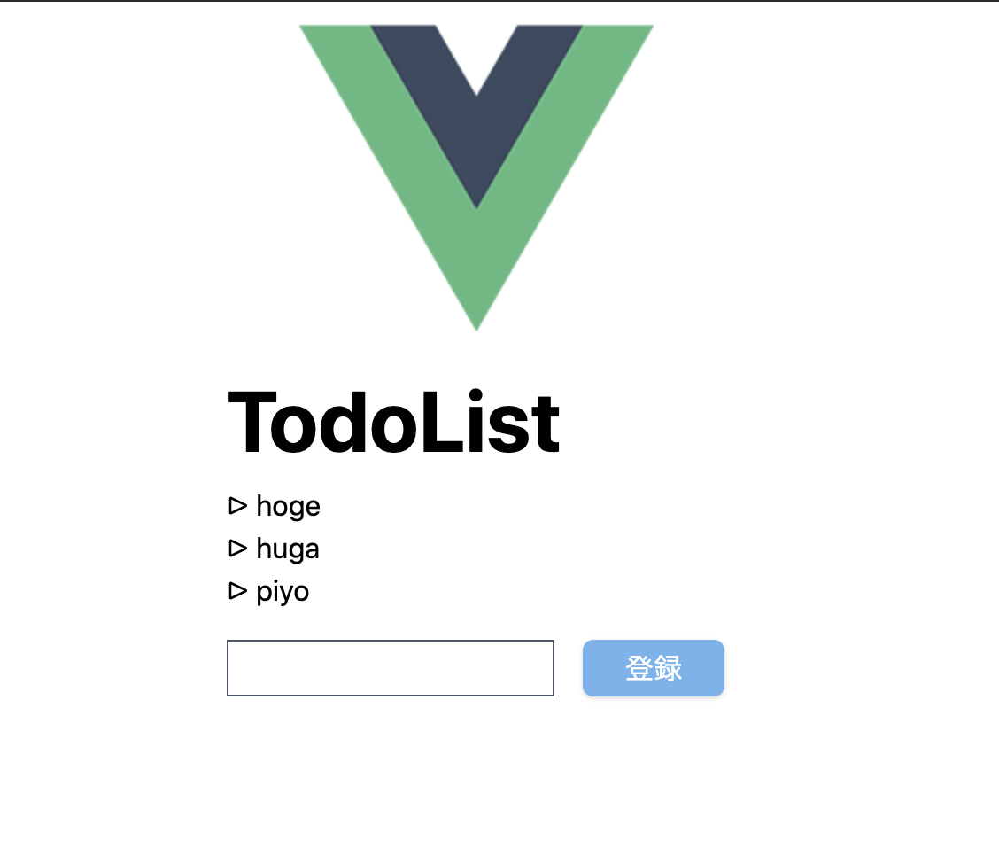

# はじめに
vue3.0が出てしばらくたった今日このごろ。  
試してみようみようと思って今まで放置していたので試してみる。  
ただvue3だけ試すのではなく、ついでにvuexとtailwindcssも試してみる。

# TL;DR.
[ソースコード](https://github.com/Tetsuya-Minase/program-samples/tree/master/vue3-sample)

# セットアップ
vueCLIが対応しているのでCLIからスタートする。  
vue3 + npmを使う設定で生成。

```bash
$ npx @vue/cli create vue3-sample
>Vue CLI v4.5.8
> ? Please pick a preset: 
>   Default ([Vue 2] babel, eslint) 
> ❯ Default (Vue 3 Preview) ([Vue 3] babel, eslint) 
>   Manually select features

> ? Pick the package manager to use when installing dependencies: 
>   Use Yarn 
> ❯ Use NPM

> 🎉  Successfully created project vue3-sample.
> 👉  Get started with the following commands:

>  $ cd vue3-sample
>  $ npm run serve
```

続いて、TypeScriptに対応していないので追加する。    
色々聞かれるのでお好みで選択していく。

```bash
$ npx @vue/cli add typescript
> ? Use class-style component syntax? No
> ? Use Babel alongside TypeScript (required for modern mode, auto-detected polyfills, transpiling JSX)? Yes
> ? Convert all .js files to .ts? Yes
> ? Allow .js files to be compiled? No
> ? Skip type checking of all declaration files (recommended for apps)? No
```

ここまでできたら一旦`npm run serve`で起動してみる。  
画像の様なデフォルトの画面が出てくればOK。


# TODOリストを作ってみる
お試しとしてTODOリストを作ってみる。  
ついでにVuexも入れておく。

## Vuex導入
正式リリースされてるバージョンはまだVue3に対応していないので、4系をバージョン指定してインストールする 。

```bash
$ npm install vuex@v4.0.0-beta.4 --save
```

## Todoリスト作成
適当にファイルを分割して作成する。  
分割する粒度は、リストの表示部分とリストに追加するフォーム部分、その2つをまとめて表示するコンポーネントの3つにする。  
更にvuexを使うため、store.tsも作成しておく。  
作ったファイルは下記のような形。

```bash
.
├── App.vue
├── components
│   └── todo
│       ├── Todo.vue
│       ├── TodoForm.vue
│       └── TodoList.vue
├── main.ts
└── store.ts
```

### TodoForm.vue
テキストボックスとリストに追加するためのボタンを用意しておく。

```vue
<template>
  <div>
    <input v-model="value" />
    <button type="button" @click="updateList">登録</button>
  </div>
</template>
<script lang="ts">
import { defineComponent, ref } from 'vue';
// 型定義がなく通らないので、エラーは無視する
// https://github.com/vuejs/vuex/issues/1736
// @ts-ignore
import { useStore } from 'vuex'

export default defineComponent({
  setup() {
    const store = useStore();
    const value = ref<string>('');
    const updateList = () => {
      store.dispatch('addItem', value.value);
      // テキストボックスの中身をリセットしておく
      value.value = '';
    }
    return {
      value,
      updateList
    }
  }
})
</script>
```

### TodoList.vue
リストにあるデータを表示する。

```vue
<template>
  <ul>
    <li v-for="item in todoList" :key="item">
      {{ item }}
    </li>
  </ul>
</template>
<script lang="ts">
import { defineComponent, computed } from "vue";
// @ts-ignore
import { useStore } from 'vuex'

export default defineComponent({
  setup() {
    const store = useStore();
    // storeの値が変わったときに再描画してほしいので、computedでラップする
    return { todoList: computed(() => store.state.todoList) };
  }
});
</script>
```

### Todo.vue
上記コンポーネントをまとめておく用。  

```vue
<template>
  <div>
    <h1>TodoList</h1>
    <TodoList />
    <TodoForm />
  </div>
</template>
<script lang="ts">
import { defineComponent } from "vue";
import TodoList from "./TodoList.vue";
import TodoForm from "./TodoForm.vue";

export default defineComponent({
  components: {
    TodoList,
    TodoForm,
  }
});
</script>
```

### Vuex導入
storeの作成とstoreをmain.tsに追加する。  
導入方法については[公式のexample](https://github.com/vuejs/vuex/tree/v4.0.0-beta.4/examples/composition)を参考にしてすすめる。

```tsx
import { createStore, Commit } from 'vuex';
const state = {
  todoList: ['hoge', 'huga', 'piyo']
};
type state = typeof state;

const mutations = {
  addItem(state: state, item: string) {
    state.todoList = [...state.todoList, item];
  }
}

const actions = {
  // ActionContextで型定義しても良さそうだが、ほとんど使わないので独自型定義
  addItem: ({commit}: {commit: Commit}, item: string) => commit('addItem', item)
};

export default createStore({
  state,
  actions,
  mutations
});
```

```tsx
import { createApp } from 'vue'
import App from './App.vue'
import Store from './store';

createApp(App)
	// ここを追加
  .use(Store)
  .mount('#app')
```

ここまで実装が終わったら、`npm run serve`で起動してみる。  
エラーなく表示されればOK。

# Tailwind導入
公式サイトを参考に導入していく。

```bash
$ npm install tailwindcss
```

configファイルの生成。  
vueがpostcssに対応しているので、postcssのconfigファイルも生成する。

```bash
$ npx tailwindcss init -p
```

cssファイルを記載する。  
公式サイトからコピペでOK。

```bash
$ touch src/assets/styles/main.css
```

```css
@tailwind base;
@tailwind components;
@tailwind utilities;
```

cssを使えるようにApp.vueを修正する。

```vue
<style src="./assets/styles/main.css">
</style>
```

画像のようにデフォルトの見た目から変わっていればOK。


# 見た目修正
このままでも良いがせっかくtailwindcssを導入したのでちょろっと見た目を修正する。

### TodoForm.vue
テキストボックスとボタンが全然わからないので、ボーダーを付けて目立たせる。  
ついでにボタンの色の変更と上のコンポーネントにくっつきすぎているので間を開ける。

```vue
<template>
  <!-- 上のコンポーネントと1rem話す -->
  <div class="mt-4">
    <!-- inline-block & border追加 & height 2rem & padding 0.5rem -->
    <input class="inline-block border border-gray-700 h-8 p-2" v-model="value" />
    <!-- 影追加 & width 5rem & margin left 1rem & 文字白 & 丸角 -->
    <button class="shadow w-20 h-8 ml-4 bg-blue-400 text-white rounded-md" type="button" @click="updateList">登録</button>
  </div>
</template>
```

### TodoList.vue
リストの先頭の点がなくなってしまったので、独自で実装する。  
ついでにリスト毎がくっつきすぎているので離す。

```vue
<template>
  <ul>
    <li v-for="item in todoList" :key="item">
      {{ item }}
    </li>
  </ul>
</template>
<style scoped>
  li::before {
    content: '▷';
    margin-right: 4px;
  }
</style>
```

### Todo.vue
`h1`の文字サイズが小さいので適度に大きくしておく。

```vue
<template>
  <div>
    <!-- font bold & font size 3rem -->
    <h1 class="font-bold text-5xl">TodoList</h1>
    <TodoList />
    <TodoForm />
  </div>
</template>
```

### App.vue
縦並びにしておく。

```vue
<template>
  <!-- 縦並び & 中央揃え -->
  <div class="flex flex-col items-center">
    
    <Todo />
  </div>
</template>
```

修正したところで画像の様になっていればOK。



# まとめ
今回はvue3 + vuex + tailwindcssを試してみた。  
vue3でTypeScriptのサポートが良くなったみたいだけど、  
vuexがまだvue3に対応していなかったりしたので、もしかしたらまだ早いのかもしれない？  

tailwindcssは細かう設定できるのでbootstrapよりは使いやすいのかなと思った。  
ただ、細かく設定できすぎるので素のcss書くのと大して変わらない気もする。  

vuex4.0がリリースされたらもう少し触ってみようと思う。

# 参考リンク
- [Introduction | Vue.js](https://v3.vuejs.org/guide/introduction.html)
- [vuejs/vuex at v4.0.0-beta.4](https://github.com/vuejs/vuex/tree/v4.0.0-beta.4)
- [Installation - Tailwind CSS](https://tailwindcss.com/docs/installation)
- [tailwindcss-setup-examples/examples/vue-cli at master · tailwindlabs/tailwindcss-setup-examples](https://github.com/tailwindlabs/tailwindcss-setup-examples/tree/master/examples/vue-cli)